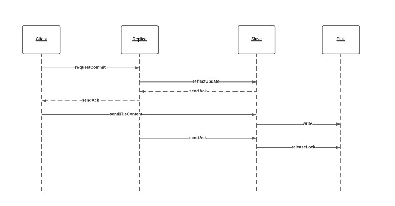

# Stock Console Mobile Application

## Aim

The objective of this project is to develop a distributed file sharing system
using the RMI framework in java.

<br>

## Description


It is required to implement a replicated file system. There will be one main server (master) and data will be partitioned and replicated on multiple replicaServers. This file system allows its concurrent users to perform transactions, while guaranteeing ACID properties.

<br>

## Design Assumptions


```
1) Master server never transfers data.
2) Creating a new file operation is atomic.
3) All files of active transactions can fit in memory of replica servers.
4) Files are small so that they can be returned as one bulk in response to read requests.
5) File chunks have a fixed size defined in Configurations class.
Writes must be performed through the primary replica of the file.

```


# Class Diagram


# Sequence Diagram


## Read operation
<br>


 
<br>

## Write operation
<br>


<br>

## Commit operation
<br>



